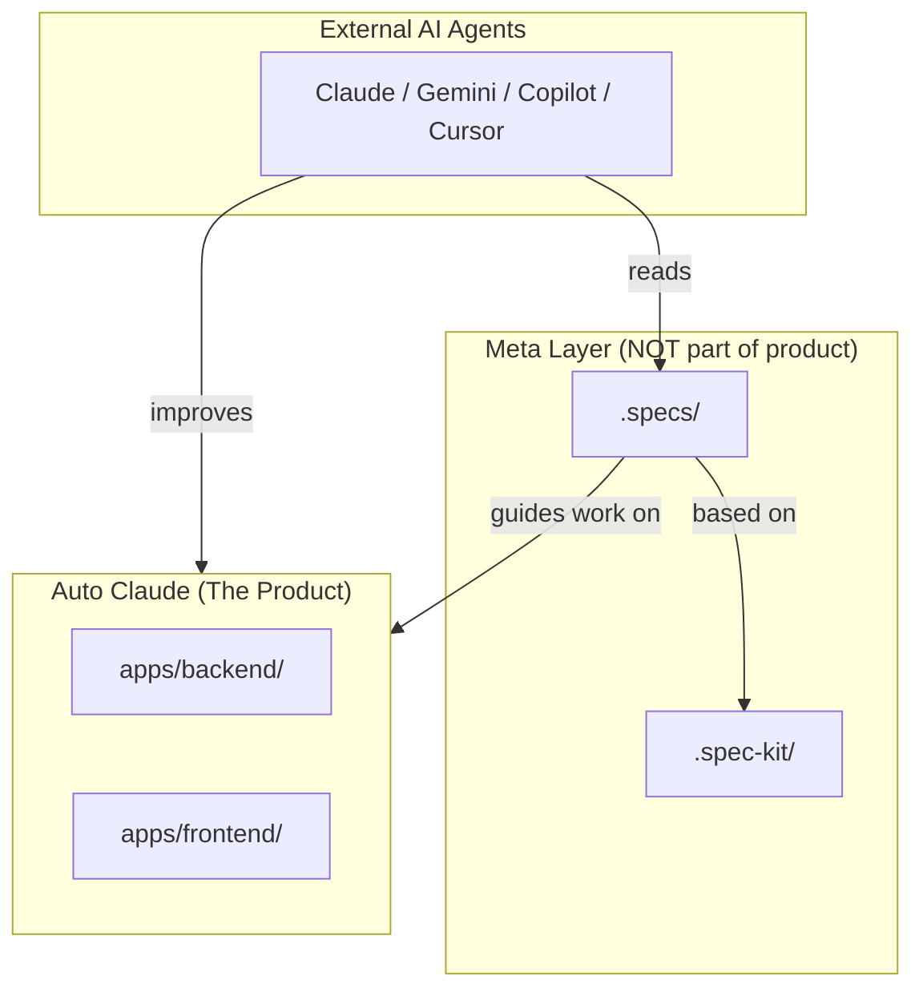

# Spec-Driven Improvement Layer

> **This is NOT part of Auto Claude.** This directory is a **meta-layer** that helps external AI agents understand and improve the Auto Claude codebase.

---

## 🏗️ The Layered Architecture

```
┌─────────────────────────────────────────────────────────────┐
│   External AI Agents (Claude, Gemini, Copilot, Cursor, etc) │
│   "I want to improve this codebase"                         │
└──────────────────────────┬──────────────────────────────────┘
                           │ reads for guidance
                           ▼
┌─────────────────────────────────────────────────────────────┐
│   .specs/  ← YOU ARE HERE                                   │
│   ══════════════════════════════════════════════════════    │
│   PURPOSE: Steering files for improving Auto Claude         │
│   AUDIENCE: External AI agents working ON this codebase     │
│   CONTENTS:                                                 │
│     • constitution.md  → Governing principles               │
│     • requirements.md  → What agents must do                │
│     • design.md        → Architecture reference             │
│     • tasks.md         → Improvement backlog                │
│     • templates.md     → How to create new specs            │
└──────────────────────────┬──────────────────────────────────┘
                           │ based on methodology from
                           ▼
┌─────────────────────────────────────────────────────────────┐
│   .spec-kit/  (Foundation Layer)                            │
│   ══════════════════════════════════════════════════════    │
│   PURPOSE: GitHub's official Spec-Driven Development kit    │
│   ORIGIN: https://github.com/github/spec-kit                │
│   CONTENTS:                                                 │
│     • templates/       → Official spec/plan/task templates  │
│     • memory/          → Constitution template              │
│     • scripts/         → Helper scripts                     │
│     • spec-driven.md   → Full methodology guide             │
│   REUSABLE: Copy to any project for SDD foundation          │
└─────────────────────────────────────────────────────────────┘

                    ║ sits BESIDE, not INSIDE ║
                    ▼                         ▼
┌─────────────────────────────────────────────────────────────┐
│   Auto Claude (The Product)                                 │
│   ══════════════════════════════════════════════════════    │
│   PURPOSE: Autonomous software engineering agent system     │
│   DIRECTORIES:                                              │
│     • apps/backend/    → Python orchestration engine        │
│     • apps/frontend/   → Electron desktop application       │
│   THIS IS THE CODEBASE BEING IMPROVED BY THE SPECS ABOVE    │
└─────────────────────────────────────────────────────────────┘
```

---

## 🎯 Key Insight

**The specs are not a feature of Auto Claude.**

They are a **control plane** for external AI agents to:
1. Understand the codebase quickly
2. Know what improvements are needed
3. Follow consistent development practices
4. Avoid duplicating effort

---

## 📚 Reading Order for AI Agents

1. **[constitution.md](constitution.md)** — The rules you must follow
2. **[requirements.md](requirements.md)** — What is expected of you
3. **[design.md](design.md)** — How the codebase is structured
4. **[tasks.md](tasks.md)** — What you can work on
5. **[templates.md](templates.md)** — How to create new specs

---

## 🔄 Relationship Diagram



---

## ❓ FAQ

**Q: Should I modify .specs/ files?**
A: Yes! Update `tasks.md` when you complete work. Update `design.md` if architecture changes.

**Q: Should I modify .spec-kit/ files?**
A: No. These are the foundation from GitHub. Keep them pristine for reuse.

**Q: Is this part of Auto Claude's runtime?**
A: No. Auto Claude never reads these files. They exist purely for AI agents improving the codebase.
