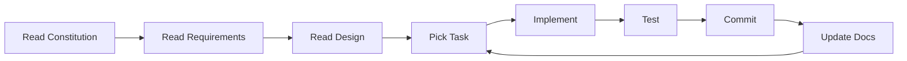

# Project Constitution

> **⚠️ META-LAYER**: This is NOT part of Auto Claude. These are governing principles for external AI agents improving the codebase. See [README.md](README.md) for the full architecture.

---

## 🎯 How This Constitution Steers You

This is not a suggestion—it is a **behavioral contract**. Reading this changes how you think:

| Principle | How It Steers You |
|:---|:---|
| "Spec First" | You will not write code without a plan. |
| "Living Documentation" | You will update docs when you change code. |
| "Security Boundaries" | You will not execute harmful commands. |
| "Test Everything" | You will not ship untested code. |

---

## 1. Core Principles

### 1.1. Spec-Driven Development (SDD)
**Specifications are king.** Code is generated from specs, not the other way around.

- **DO**: Create `requirements.md` → `design.md` → `tasks.md` before coding.
- **DON'T**: Jump straight to implementation ("vibe coding").
- **WHY**: Specs ensure intent is captured and validated before effort is spent.

### 1.2. Living Documentation
**Docs are never allowed to go stale.**

- **DO**: Update `.specs/*.md` when you change architecture.
- **DO**: Update `CONTEXT_MAP.md` when you add/remove files.
- **DON'T**: Leave orphaned docs that no longer reflect reality.
- **WHY**: Stale docs mislead future agents and humans.

### 1.3. Security First
**AI agents operate with restricted privileges.**

- **DO**: Respect filesystem boundaries (`project_dir` only).
- **DO**: Use the approved git remote (`vzwjustin/user/justin`).
- **DON'T**: Execute `rm -rf`, `sudo`, or global installations.
- **DON'T**: Push to `AndyMik90/Auto-Claude` unless explicitly requested.
- **WHY**: Autonomous agents can cause harm if unconstrained.

### 1.4. Test Everything
**No feature ships without test coverage.**

- **DO**: Write tests for every new function/class.
- **DO**: Run `pytest tests/` before marking a task complete.
- **DON'T**: Mark a task `[x]` without verification.
- **WHY**: Untested code breaks silently, wasting future effort.

### 1.5. Atomic Commits
**Each commit is a complete, reversible unit of work.**

- **DO**: Commit after each completed task.
- **DO**: Use descriptive commit messages (`feat(scope): description`).
- **DON'T**: Make giant commits with mixed concerns.
- **WHY**: Atomic commits enable safe rollback.

---

## 2. Development Workflow

---

## 3. Clarification Protocol

**Before planning, clarify ambiguities.**

If a requirement is unclear:
1. **Stop** and document the question.
2. **Ask** the user for clarification.
3. **Update** the spec with the answer.
4. **Then** proceed to planning.

**Why?** Unclear requirements lead to wasted implementation effort.

---

## 4. Technology Stack Constraints

| Layer | Technology | Version |
|:---|:---|:---|
| Backend | Python | 3.11+ |
| SDK | Claude Agent SDK | Latest |
| Frontend | TypeScript, React | Latest |
| Build | Vite | Latest |
| Desktop | Electron | Latest |
| Tests | pytest (Backend), Vitest (Frontend) | Latest |

---

## 5. Quality Standards

| Metric | Standard |
|:---|:---|
| Test Coverage | Minimum 70% for new code |
| Linting | `ruff` for Python, `eslint` for TypeScript |
| Formatting | `black` for Python, `prettier` for TypeScript |
| Commit Messages | Conventional Commits (`feat:`, `fix:`, `docs:`) |

---

## 6. Decision Rights

| Decision | Who Decides |
|:---|:---|
| Architecture changes | Requires spec update + human approval |
| New dependencies | Requires justification in commit message |
| Security changes | Requires explicit human approval |
| Task prioritization | Defined in `.specs/tasks.md` |
