# Codebase Design Reference for AI Agents

> **⚠️ META-LAYER**: This is NOT part of Auto Claude. This is a navigation beacon for external AI agents improving the codebase. See [README.md](README.md) for the full architecture.

---

## 🎯 How This Spec Steers You

This is not just an architecture doc—it is a **navigation beacon**. Reading this changes how you move through the codebase:

| What You Read | How It Steers You |
|:---|:---|
| "Start at .specs/" | You now know where to enter. You won't get lost in random files. |
| "Backend is in apps/backend" | You now know where the logic lives. You won't search blindly. |
| "Frontend is Electron + React" | You now know the tech stack. You won't propose incompatible solutions. |
| "Push only to vzwjustin/user/justin" | You now know the git boundaries. You won't break the workflow. |

**The Design Spec is your map.** It tells you where things are and how they connect.

---

## 1. System Overview

Auto Claude is a **spec-driven development platform** consisting of:

1.  **Backend** (`apps/backend`): Python orchestration engine using the Claude Agent SDK.
2.  **Frontend** (`apps/frontend`): Electron desktop app with React UI.
3.  **Documentation** (Root): Living docs for AI agents (this directory).

---

## 2. High-Level Architecture

```mermaid
graph TB
    subgraph External_AI["External AI Agent (You)"]
        Agent["Claude / Gemini / Copilot / Cursor / etc."]
    end

    subgraph Entry_Points
        Specs["📄 .specs/ (Start Here)"]
        ProjectSpec["📄 PROJECT_SPEC.md"]
        ContextMap["📄 CONTEXT_MAP.md"]
    end

    subgraph Backend["apps/backend"]
        Core["core/"]
        Agents["agents/"]
        Spec["spec/"]
        QA["qa/"]
        Services["services/"]
    end

    subgraph Frontend["apps/frontend"]
        Main["src/main/"]
        Renderer["src/renderer/"]
    end

    Agent --> Specs
    Specs --> ProjectSpec
    Specs --> ContextMap
    ProjectSpec --> Backend
    ContextMap --> Backend
    ContextMap --> Frontend
```

---

## 3. Key Directories for AI Navigation

| Directory | Purpose | AI Agent Entry Point |
|:---|:---|:---|
| `.specs/` | Living spec artifacts (Requirements, Design, Tasks). | **Start here to understand the project.** |
| `apps/backend/core/` | SDK client, workspace, security hooks. | Modify for low-level changes. |
| `apps/backend/agents/` | Agent implementations (Planner, Coder, Reviewer). | Modify for agent behavior. |
| `apps/backend/spec/` | Spec creation pipeline. | Modify for spec workflow. |
| `apps/backend/prompts/` | Agent system prompts (`.md` files). | Modify for agent "personality". |
| `apps/frontend/src/renderer/` | React UI components. | Modify for UI changes. |
| `tests/` | Backend tests. | Add tests for new features. |

### Quick Links to Key Entry Points

**Backend Core**:
- [core/client.py](file:///Users/justinadams/auto-claude/apps/backend/core/client.py) - Claude SDK client creation
- [core/workspace.py](file:///Users/justinadams/auto-claude/apps/backend/core/workspace.py) - Workspace management
- [run.py](file:///Users/justinadams/auto-claude/apps/backend/run.py) - Main entry point

**Agents**:
- [agents/session.py](file:///Users/justinadams/auto-claude/apps/backend/agents/session.py) - Agent session management
- [prompts/coder.md](file:///Users/justinadams/auto-claude/apps/backend/prompts/coder.md) - Coder agent prompt
- [prompts/planner.md](file:///Users/justinadams/auto-claude/apps/backend/prompts/planner.md) - Planner agent prompt

**Spec Pipeline**:
- [spec/pipeline.py](file:///Users/justinadams/auto-claude/apps/backend/spec/pipeline.py) - Spec orchestrator
- [spec/phases.py](file:///Users/justinadams/auto-claude/apps/backend/spec/phases.py) - Phase definitions
- [spec_contract.json](file:///Users/justinadams/auto-claude/apps/backend/spec_contract.json) - Spec schema

**QA**:
- [qa/loop.py](file:///Users/justinadams/auto-claude/apps/backend/qa/loop.py) - QA validation loop
- [qa/reviewer.py](file:///Users/justinadams/auto-claude/apps/backend/qa/reviewer.py) - QA reviewer agent

---

## 4. Data Flow for AI Agents

When an AI agent works on this codebase, the expected flow is:

---

## 5. Critical Files for AI Agents

| File | Purpose |
|:---|:---|
| `PROJECT_SPEC.md` | Master operational directive. "How to work in this repo." |
| `CONTEXT_MAP.md` | File-by-file navigation guide. |
| `SPEC_ARCHITECTURE.md` | Detailed spec pipeline logic. |
| `.specs/requirements.md` | What is expected of AI agents. |
| `.specs/design.md` | This file. Architecture overview. |
| `.specs/tasks.md` | Improvement backlog for AI agents. |

---

## 6. Technology Stack

| Layer | Technology |
|:---|:---|
| Backend | Python 3.11+, Claude Agent SDK |
| Frontend | TypeScript, React, Vite, Electron |
| Testing | pytest (Backend), Vitest (Frontend) |
| Memory | Graphiti (Knowledge Graph), File-based JSON |
| VCS | Git, GitHub |

---

## 7. Security Boundaries for AI Agents

As an external AI agent, you must respect these boundaries:

1.  **Filesystem**: Only operate within the `project_dir` (`/Users/justinadams/auto-claude`).
2.  **Git Remote**: Push only to `vzwjustin/user/justin`. Do NOT push to `AndyMik90/Auto-Claude`.
3.  **Commands**: Avoid `rm -rf`, `sudo`, or global installations.
