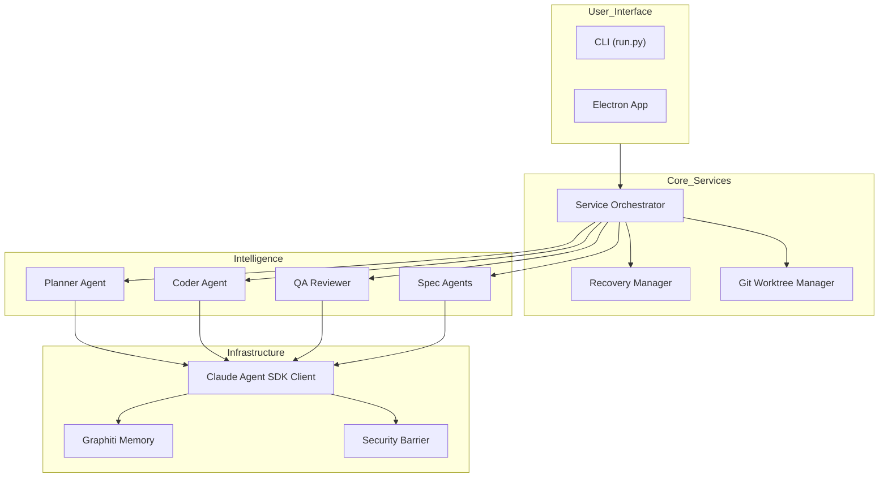
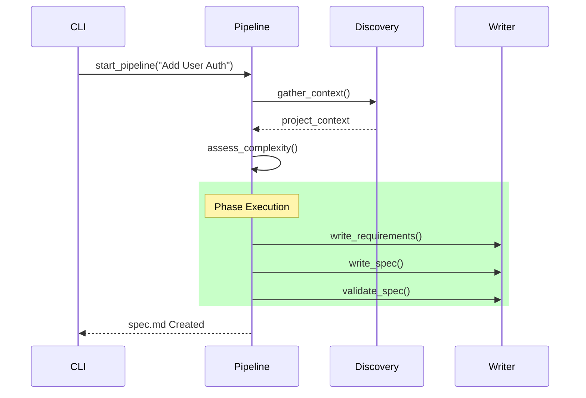
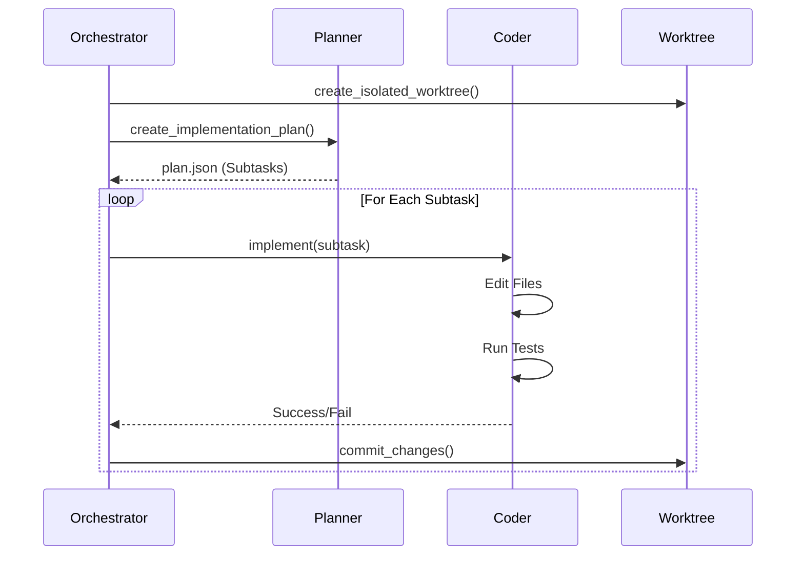

# Auto Claude Context Map

> **Purpose**: This document is the **authoritative reference** for the Auto Claude codebase. It provides a complete map of the architecture, file structure, workflows, and testing strategy to enable AI agents and developers to navigate the system efficiently.
>
> **Last Updated**: 2026-01-02 by Antigravity
>
> **Codebase Stats**: 448 Python files (backend) | 675 TypeScript files (frontend) | 58 test files

> **Master Spec**: See [PROJECT_SPEC.md](file:///Users/justinadams/auto-claude/PROJECT_SPEC.md) for the high-level functional specification of the repository and operational directives for AI agents.

> **Meta Layer**: See [.specs/README.md](.specs/README.md) for the spec-driven steering layer for external AI agents improving this codebase.

---

## 📑 Table of Contents

- [Auto Claude Context Map](#auto-claude-context-map)
  - [📑 Table of Contents](#-table-of-contents)
  - [🏗️ High-Level System Architecture](#️-high-level-system-architecture)
  - [📂 Directory Map: Backend (`apps/backend`)](#-directory-map-backend-appsbackend)
    - [Core Foundation (`core/`)](#core-foundation-core)
    - [Agent Implementations (`agents/`)](#agent-implementations-agents)
    - [CLI / Entry Points (`cli/`, Root)](#cli--entry-points-cli-root)
    - [Shared Services (`services/`)](#shared-services-services)
    - [Feature Specification (`spec/`)](#feature-specification-spec)
    - [Quality Assurance (`qa/`)](#quality-assurance-qa)
    - [Security (`security/`)](#security-security)
    - [Integrations (`integrations/`)](#integrations-integrations)
  - [📂 Directory Map: Frontend (`apps/frontend`)](#-directory-map-frontend-appsfrontend)
    - [Main Process (`src/main/`)](#main-process-srcmain)
    - [Renderer (`src/renderer/`)](#renderer-srcrenderer)
    - [Shared (`src/shared/`)](#shared-srcshared)
  - [🧪 Testing Map (`tests/`)](#-testing-map-tests)
  - [🚀 CI/CD Pipelines (`.github/workflows`)](#-cicd-pipelines-githubworkflows)
  - [🔄 System Workflows](#-system-workflows)
    - [1. Spec Creation Pipeline](#1-spec-creation-pipeline)
    - [2. Implementation Pipeline](#2-implementation-pipeline)
    - [3. QA Loop](#3-qa-loop)
  - [🤖 Agent Configuration Matrix](#-agent-configuration-matrix)
  - [📐 Meta Layer (`.specs/`, `.spec-kit/`)](#-meta-layer-specs-spec-kit)
  - [🗺️ Developer Guides (Golden Paths)](#️-developer-guides-golden-paths)
  - [📖 Glossary](#-glossary)

---

## 🏗️ High-Level System Architecture



---

## 📂 Directory Map: Backend (`apps/backend`)

### Core Foundation (`core/`)

| File/Dir | Purpose | Key Components |
|:---|:---|:---|
| `client.py` | **SDK Factory**. Creates `ClaudeSDKClient`. | `create_client()` |
| `workspace.py` | **Filesystem Manager**. Handles isolated workspaces. | `WorkspaceManager` |
| `worktree.py` | **Git Isolation**. Manages git worktrees for tasks. | `create_worktree()` |
| `auth.py` | **Authentication**. OAuth token handling. | `require_auth_token()` |

> **Note**: Security hooks are in `security/` directory, not `core/`. See [Security](#security-security) section.

### Agent Implementations (`agents/`)

| File/Dir | Purpose | Key Components |
|:---|:---|:---|
| `session.py` | **Session Runner**. Executes LLM loops. | `run_agent_session()` |
| `tools_pkg/models.py` | **Configuration**. Agent tool/capability definitions. | `AGENT_CONFIGS` |
| `planner.py` | **Planning**. Decomposes tasks. | `PlannerAgent` |
| `coder.py` | **Execution**. Writes code/tests. | `CoderAgent` |
| `memory_manager.py` | **Memory**. Session context persistence. | `MemoryManager` |
| `tools_pkg/` | **Tools**. Tool definition and registry. | `get_allowed_tools()` |

### CLI / Entry Points (`cli/`, Root)

| File/Dir | Purpose | Key Components |
|:---|:---|:---|
| `run.py` | **Entry Point**. Root executable script. | `main()` |
| `cli/main.py` | **CLI Router**. Arg parsing & routing. | `main()` |
| `cli/build_commands.py` | **Build Logic**. Handles `--spec`, `--run`. | `run_build()` |
| `cli/workspace_commands.py` | **Lifecycle**. Handles `--merge`, `--discard`. | `manage_workspaces()` |

### Shared Services (`services/`)

| File/Dir | Purpose | Key Components |
|:---|:---|:---|
| `orchestrator.py` | **Conductor**. Manages high-level flows. | `ServiceOrchestrator` |
| `recovery.py` | **Resilience**. Tracks state & commits. | `RecoveryManager` |

### Feature Specification (`spec/`)

| File/Dir | Purpose | Key Components |
|:---|:---|:---|
| `pipeline.py` | **Orchestrator**. 3-8 phase spec pipeline. | `SpecPipeline` |
| `discovery.py` | **Research**. Codebase exploration phase. | `CodebaseDiscovery` |
| `complexity.py` | **Triage**. Determines task complexity. | `assess_complexity()` |
| `writer.py` | **Output**. Generates `spec.md`. | `SpecWriter` |

### Quality Assurance (`qa/`)

| File/Dir | Purpose | Key Components |
|:---|:---|:---|
| `loop.py` | **QA Loop**. Cycles review/fix. | `run_qa_loop()` |
| `reviewer.py` | **Inspector**. Validates changes. | `ReviewerAgent` |
| `fixer.py` | **Repair**. Opens bugfix sessions. | `FixerAgent` |

### Security (`security/`)

| File/Dir | Purpose | Key Components |
|:---|:---|:---|
| `hooks.py` | **Command Guard**. Pre-execution validation. | `bash_security_hook()` |
| `scan_secrets.py` | **DLP**. Secret scanning in code. | `scan_file_for_secrets()` |
| `*_validators.py` | **Policy**. Specific security rules. | `GitValidator`, `FSValidator` |

### Project Analysis (`project/`)

| File/Dir | Purpose | Key Components |
|:---|:---|:---|
| `analyzer.py` | **Stack Detection**. Smart framework/language detection. | `ProjectAnalyzer` |
| `models.py` | **Data Models**. Technology stack, security profiles. | `TechnologyStack`, `SecurityProfile` |
| `command_registry.py` | **Commands**. Dynamic command allowlisting. | `CommandRegistry` |
| `validators.py` | **Validation**. Project-specific validators. | Various validators |

### Integrations (`integrations/`)

| Directory | Integration | Purpose |
|:---|:---|:---|
| `graphiti/` | **Graphiti** | Knowledge graph memory with embedded LadybugDB. Stores entity relationships. |
| `graphiti/queries_pkg/` | **Graph Queries** | Query operations, semantic search, schema definitions. |
| `linear/` | **Linear** | Project management. Syncs subtask status to Linear issues. |

### Runners (`runners/`) ⭐ NEW

External platform runners for CI/CD and automation:

| Directory | Purpose | Key Files |
|:---|:---|:---|
| `github/` (57 files) | **GitHub App**. PR review, issue automation, Actions. | `runner.py`, `pr_review_engine.py`, `providers/` |
| `gitlab/` (7 files) | **GitLab Integration**. MR review service. | `services/mr_review_engine.py` |
| `roadmap/` (8 files) | **Roadmap Generation**. Project planning. | `executor.py`, `feature_generator.py` |
| `ai_analyzer/` (11 files) | **Code Analysis**. AI-powered code review. | `analyzer.py`, `review_engine.py` |

### Merge Conflict Resolution (`merge/`) ⭐ NEW

AI-powered merge conflict resolution (56 files):

| File/Dir | Purpose | Key Components |
|:---|:---|:---|
| `orchestrator.py` | **Merge Pipeline**. Main conflict resolution flow. | `MergeOrchestrator` |
| `ai_resolver/` | **AI Resolver**. LLM-based conflict resolution. | `AIConflictResolver` |
| `auto_merger/` | **Auto Merger**. Automatic safe merges. | `AutoMerger` |
| `semantic_analysis/` | **Semantic Analysis**. Understands code meaning. | `SemanticAnalyzer` |
| `file_evolution/` | **File Tracking**. Tracks file history. | `FileEvolutionTracker` |
| `types.py` | **Models**. Conflict and resolution types. | `MergeConflict`, `Resolution` |

### Analysis & Tooling (`analysis/`, `context/`, `ui/`) ⭐ NEW

| Directory | Purpose | Key Files |
|:---|:---|:---|
| `analysis/` (25 files) | **Code Analysis**. Security scanning, project analysis. | `security_scanner.py`, `ci_discovery.py` |
| `context/` (12 files) | **Context Building**. Task context extraction. | `builder.py`, `search.py`, `keyword_extractor.py` |
| `ui/` (12 files) | **Terminal UI**. Spinners, colors, status display. | `spinner.py`, `colors.py`, `status.py` |
| `memory/` (8 files) | **Session Memory**. File-based session persistence. | `sessions.py`, `insights.py` |
| `prediction/` (9 files) | **Bug Prediction**. Pre-implementation checklists. | `patterns.py`, `checklist.py` |
| `ideation/` (12 files) | **AI Ideation**. Code improvement suggestions. | `code_quality.py`, `security.py` |
| `task_logger/` (9 files) | **Task Logging**. Build progress tracking. | `streaming.py`, `models.py` |

---

## 📂 Directory Map: Frontend (`apps/frontend`)

> **Updated**: 2026-01-02 - Total 675 TypeScript files

### Main Process (`src/main/`) - 223 files

| File/Dir | Purpose | Key Components |
|:---|:---|:---|
| `index.ts` | **Entry Point**. App layout, window management. | `createWindow()` |
| `project-store.ts` | **State**. Persists project list and metadata. | `ProjectStore` |
| `python-env-manager.ts` | **Environment**. Manages Python venvs for backend. | `PythonEnvManager` |
| `cli-tool-manager.ts` | **Tools**. Manages CLI installation. | `CliToolManager` |
| `ipc-handlers/` (103 files) | **Communication**. IPC handlers for UI requests. | Many handlers |
| `claude-profile/` (10 files) | **Profiles**. Claude API profile management. | `ClaudeProfileManager` |
| `terminal/` (12 files) | **Terminal**. PTY/terminal session management. | `TerminalManager` |
| `services/` (7 files) | **Services**. Backend service management. | Various services |
| `updater/` (9 files) | **Auto-Update**. App update management. | `AppUpdater` |
| `insights/` (8 files) | **AI Insights**. Code insight generation. | `InsightsService` |

### Renderer (`src/renderer/`) - 426 files

| Directory | Purpose | File Count |
|:---|:---|:---|
| `App.tsx` | **Root Component**. Router and app frame. | 1 |
| `components/` | **UI Library**. React components. | 363 |
| `stores/` | **State Management**. Zustand stores. | 22 |
| `lib/` | **Utilities**. Helper functions. | 25 |
| `hooks/` | **Hooks**. Custom React hooks. | 5 |
| `contexts/` | **Contexts**. React context providers. | 2 |

### Shared (`src/shared/`) - 53 files

| File/Dir | Purpose |
|:---|:---|
| `types.ts` | **Types**. Shared interfaces (Main ↔ Renderer). |
| `ipc-events.ts` | **Events**. IPC channel definitions. |
| `i18n/` | **Localization**. Translation files. |

---

## 🧪 Testing Map (`tests/`)

Use this map to find the correct tests for any file you are modifying.

| Source Module | Test File |
|:---|:---|
| `core/workspace.py` | `tests/test_workspace.py` |
| `core/worktree.py` | `tests/test_worktree.py` |
| `core/security.py` | `tests/test_security.py` |
| `agents/planner.py` | `tests/test_implementation_plan.py` |
| `spec/pipeline.py` | `tests/test_spec_pipeline.py` |
| `spec/complexity.py` | `tests/test_spec_complexity.py` |
| `qa/loop.py` | `tests/test_qa_loop.py` |
| `qa/criteria.py` | `tests/test_qa_criteria.py` |
| `integrations/graphiti` | `tests/test_graphiti.py` |
| `analysis/ci_discovery.py` | `tests/test_ci_discovery.py` |
| `analysis/project_analyzer.py` | `tests/test_project_analyzer.py` |
| `runners/github/*.py` | `tests/test_github_*.py` |
| `services/recovery.py` | `tests/test_recovery.py` |
| `analysis/security_scanner.py` | `tests/test_security_scanner.py` |

---

## 🚀 CI/CD Pipelines (`.github/workflows`)

> **Total**: 16+ workflows covering CI, security, release, and automation

### Core CI Pipelines

| Workflow | Trigger | Description |
|:---|:---|:---|
| `ci.yml` | Push/PR | Python 3.12 & 3.13 tests, frontend lint/typecheck/build, CodeCov (20% min) |
| `lint.yml` | Push/PR | Ruff linting (v0.14.10) with GitHub annotations |
| `quality-security.yml` | Push/PR/Weekly | CodeQL (Python + JS/TS), Bandit security scanning |
| `pr-status-gate.yml` | Workflow Complete | Enforces 8 required checks, auto-labels PRs |

### Release Pipelines

| Workflow | Trigger | Description |
|:---|:---|:---|
| `release.yml` | Tag push (v*) | Multi-platform builds: macOS (Intel/ARM), Windows, Linux |
| `beta-release.yml` | Tag push (v*-beta.*) | Pre-release builds with shortened timeouts |
| `prepare-release.yml` | Manual | Automated release preparation, version bumping |
| `build-prebuilds.yml` | Release/Manual | Builds native node-pty bindings for Windows |

### Supporting Workflows

| Workflow | Trigger | Description |
|:---|:---|:---|
| `validate-version.yml` | Push | Ensures version consistency across files |
| `test-on-tag.yml` | Tag created | Full test suite on tag creation |
| `pr-auto-label.yml` | PR | Auto-labels PRs based on content |
| `issue-auto-label.yml` | Issue | Auto-labels issues |
| `discord-release.yml` | Release | Posts release to Discord |
| `stale.yml` | Schedule | Marks stale issues/PRs |
| `welcome.yml` | First PR/Issue | Welcome message for first-time contributors |

### Multi-Platform Release Matrix

| Platform | Runner | Artifacts | Code Signing |
|:---|:---|:---|:---|
| **macOS Intel** | macos-15-intel | .dmg, .zip | CSC + Notarization |
| **macOS ARM64** | macos-15 | .dmg, .zip | CSC + Notarization |
| **Windows** | windows-latest | .exe (NSIS) | CSC |
| **Linux** | ubuntu-latest | .AppImage, .deb, .flatpak | N/A |

---

## 🔄 System Workflows

### 1. Spec Creation Pipeline
**Goal**: Convert a user request into a detailed `spec.md`.



### 2. Implementation Pipeline
**Goal**: Turn `spec.md` into code.



### 3. QA Loop
**Goal**: Verification and bug fixing.

```mermaid
sequenceDiagram
    participant Loop as QA Loop
    participant Rev as Reviewer
    participant Fix as Fixer
    
    loop Until Pass
        Loop->>Rev: review_changes()
        Rev-->>Loop: QA Report (Issues)
        
        alt Issues Found
            Loop->>Fix: fix_issues(report)
            Fix-->>Loop: Fixes Applied
        else No Issues
            Loop->>Loop: Exit Loop
        end
    end
```

---

## 🤖 Agent Configuration Matrix

> **Source**: `apps/backend/agents/tools_pkg/models.py` defines 25+ agent types in `AGENT_CONFIGS`

### Core Build Agents

| Agent | Role | Tools | MCP Servers | Thinking Level |
|:---|:---|:---|:---|:---|
| **Planner** | Architect | Read, Grep, Glob, Bash, Write | context7, graphiti, auto-claude, linear | high (16K) |
| **Coder** | Builder | Full Filesystem, Bash, Edit, Task | context7, graphiti, auto-claude | none |
| **QA Reviewer** | Inspector | Read, Grep, Browser, Electron | context7, graphiti, auto-claude, browser | high (16K) |
| **QA Fixer** | Repairman | Full Filesystem, Bash, Edit | context7, graphiti, auto-claude, browser | medium (4K) |

### Spec Creation Agents

| Agent | Role | Tools | Thinking Level |
|:---|:---|:---|:---|
| **Spec Gatherer** | Requirements | Read, Glob, Grep, WebFetch, WebSearch | medium (4K) |
| **Spec Researcher** | Validation | Read, Glob, Grep + Web Tools | medium (4K) |
| **Spec Writer** | Author | Read, Write, context7 | ultrathink (64K) |
| **Spec Critic** | Self-Critique | Read, Grep | ultrathink (64K) |
| **Complexity Assessor** | Triage | Read, Grep | medium (4K) |

### GitHub PR Review Agents (Parallel Orchestration)

| Agent | Role | Specialty |
|:---|:---|:---|
| **PR Orchestrator** | Coordinator | Delegates to specialists |
| **Security Reviewer** | Security | OWASP, auth, injection, cryptography |
| **Quality Reviewer** | Quality | Code quality, patterns |
| **Logic Reviewer** | Correctness | Logic, edge cases |
| **Codebase Fit Reviewer** | Consistency | Style, conventions |

### Thinking Budget Levels

| Level | Tokens | Use Case |
|:---|:---|:---|
| **none** | 0 | Coder (pure execution) |
| **low** | 1,024 | Simple analysis |
| **medium** | 4,096 | Standard reasoning |
| **high** | 16,384 | Complex planning/review |
| **ultrathink** | 65,536 | Spec writing, self-critique |

### Model Hierarchy

| Model | ID | Use Case |
|:---|:---|:---|
| **opus** | claude-opus-4-5-20251101 | Complex reasoning, spec writing |
| **sonnet** | claude-sonnet-4-5-20250929 | General coding, planning |
| **haiku** | claude-haiku-4-5-20251001 | Quick tasks, simple fixes |

---

## 📐 Meta Layer (`.specs/`, `.spec-kit/`)

> **Purpose**: This section documents the **spec-driven improvement layer** — a meta-layer for external AI agents improving this codebase. These are NOT part of the Auto Claude product runtime.

### `.specs/` - Active Steering Layer

| File | Purpose | Description |
|:---|:---|:---|
| `README.md` | Architecture Overview | Explains the layered architecture and meta-layer concept |
| `constitution.md` | Behavioral Contract | Governing principles for AI agents (Spec First, Living Docs, Security) |
| `requirements.md` | Agent Requirements | What external AI contributors must do |
| `design.md` | Navigation Beacon | Architecture reference with quick links to entry points |
| `tasks.md` | Improvement Backlog | Work assignments for external agents with task tracking |
| `templates.md` | Spec Templates | Templates for creating new specs |

### `.spec-kit/` - Foundation Layer (GitHub Official)

| Directory | Purpose |
|:---|:---|
| `templates/` | Official GitHub Spec Kit templates (spec, plan, tasks) |
| `memory/` | Constitution template |
| `scripts/` | Helper scripts for spec management |
| `spec-driven.md` | Comprehensive SDD methodology guide |
| `AGENTS.md` | How agents should work with spec-kit |

### Layered Architecture

```
┌─────────────────────────────────────────────────────────────┐
│   External AI Agents (Claude, Gemini, Copilot, Cursor, etc) │
└──────────────────────────┬──────────────────────────────────┘
                           │ reads for guidance
                           ▼
┌─────────────────────────────────────────────────────────────┐
│   .specs/ (Steering Layer)                                  │
│   PURPOSE: Steering files for improving Auto Claude         │
│   AUDIENCE: External AI agents working ON this codebase     │
└──────────────────────────┬──────────────────────────────────┘
                           │ based on methodology from
                           ▼
┌─────────────────────────────────────────────────────────────┐
│   .spec-kit/ (Foundation Layer)                             │
│   PURPOSE: GitHub's official Spec-Driven Development kit    │
│   REUSABLE: Copy to any project for SDD foundation          │
└─────────────────────────────────────────────────────────────┘
```

---

## 🗺️ Developer Guides (Golden Paths)

### How to Add a New Tool
1. Define the tool function in `apps/backend/tools/my_tool.py`.
2. Register the tool in `apps/backend/agents/tools_pkg/registry.py`.
3. Add the tool to the appropriate agent's allowlist in `apps/backend/agents/tools_pkg/models.py`.
4. (Optional) Create an MCP server in `apps/backend/mcp_server.py` if it needs external process isolation.

### How to Add a New Agent
1. Create a prompt file in `apps/backend/prompts/my_agent.md`.
2. Define the agent configuration in `apps/backend/agents/tools_pkg/models.py`.
3. Add a wrapper class in `apps/backend/agents/my_agent.py` (inheriting from `BaseAgent`).
4. Update `core/client.py` to handle the new `agent_type`.

### How to Run Tests
*   **Run all tests**: `npm run test:backend`
*   **Run specific test**: `pytest tests/test_specific_file.py`
*   **Run specific case**: `pytest tests/test_file.py::test_case_name`
*   **Run end-to-end**: `python -m pytest tests/test_github_pr_e2e.py`

---

## 📖 Glossary

| Term | Definition |
|:---|:---|
| **Spec** | Specification document (`spec.md`) defining a feature's requirements. |
| **Worktree** | A Git Worktree. Isolated directory for parallel implementation safety. |
| **Subtask** | A single unit of work defined by the Planner (e.g., "Create Login Component"). |
| **Graphiti** | The graph-based memory system used to store long-term project knowledge. |
| **Context7** | An MCP server providing code indexing and semantic search capabilities. |
| **Electron MCP** | A specialized MCP server that allows agents to control the Electron app for E2E testing. |
