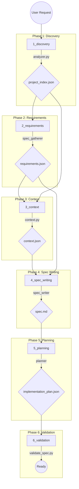

# Auto Claude Spec Architecture

> **Purpose**: This document defines the **Spec-Driven Development** methodology used by Auto Claude. It explains how features are defined, planned, and implemented using a structured pipeline of JSON schemas and Markdown documents. **All agents must strictly adhere to this architecture.**

---

## 🏗️ The Spec Pipeline

The spec creation process is a deterministic state machine defined in [spec_contract.json](file:///Users/justinadams/auto-claude/apps/backend/spec/spec_contract.json). It consists of 6 distinct phases that transform a vague user request into an executable plan.



---

## 📂 Spec Artifacts & Data Models

Every feature request generates a dedicated directory in `.auto-claude/specs/<ID>-<SLUG>/`. This directory contains the following immutable artifacts:

### 1. `project_index.json` (Phase 1)
**Generator**: `analyzer.py`
**Purpose**: High-level structural snapshot of the repo.
```json
{
  "project_type": "single",
  "languages": ["python", "typescript"],
  "frameworks": ["react", "electron", "pytest"],
  "root_dir": "/abs/path/to/repo"
}
```

### 2. `requirements.json` (Phase 2)
**Generator**: `Spec Gatherer` (Agent)
**Purpose**: Structured user requirements.
```json
{
  "task_description": "Add OAuth login via Google",
  "workflow_type": "feature",
  "services_involved": ["auth", "frontend"],
  "constraints": ["Must use existing auth.py", "No external libs"]
}
```

### 3. `context.json` (Phase 3)
**Generator**: `context.py`
**Purpose**: Relevant file paths and definitions.
```json
{
  "task_description": "...",
  "files_to_modify": ["apps/backend/core/auth.py"],
  "files_to_reference": ["apps/backend/core/client.py"],
  "definitions": {
    "auth.py": ["class OAuthManager", "def login"]
  }
}
```

### 4. `spec.md` (Phase 4)
**Generator**: `Spec Writer` (Agent)
**Purpose**: Human-readable source of truth.
**Required Sections**:
- **Overview**: What are we building?
- **Workflow Type**: `feature` | `refactor` | `bugfix`
- **Task Scope**: In-scope vs Out-of-scope.
- **Success Criteria**: verifiable conditions (e.g., "User can login with Google").
- **Proposed Changes**: File-by-file impact analysis.

### 5. `implementation_plan.json` (Phase 5)
**Generator**: `Planner` (Agent)
**Purpose**: Machine-executable instructions for the Coder agent.
```json
{
  "feature": "Google OAuth",
  "workflow_type": "feature",
  "phases": [
    {
      "phase": "backend",
      "name": "Backend Implementation",
      "chunks": [
        {
          "id": "1",
          "description": "Add google-auth lib to requirements.txt",
          "status": "pending"
        },
        {
          "id": "2",
          "description": "Implement verify_google_token in auth.py",
          "status": "pending",
          "dependencies": ["1"]
        }
      ]
    }
  ]
}
```

---

## 🤖 Agent Roles in Spec Process

| Agent | Trigger | Input | Output | Strategy |
|:---|:---|:---|:---|:---|
| **Spec Gatherer** | Phase 2 | User Chat | `requirements.json` | Ask clarifying questions until ambiguites are resolved. |
| **Spec Writer** | Phase 4 | `requirements.json`, `context.json` | `spec.md` | Synthesize requirements into a technical design document. Use "Ultrathink" (16k tokens) for reasoning. |
| **Planner** | Phase 5 | `spec.md` | `implementation_plan.json` | Break down the spec into atomic, verifiable integration steps. |
| **Spec Fixer** | On Failure | `validation_errors.json` | Corrections | Targeted JSON editing to fix schema violations. |

---

## 🛠️ Validation Rules

The system enforces strict validation at each gate via `validate_spec.py`.

*   **JSON Schema**: All JSON files must match the schema in `spec_contract.json`.
*   **Markdown Structure**: `spec.md` must contain specific headers ("Overview", "Success Criteria").
*   **File Existence**: `files_to_modify` in `context.json` must exist (unless marked as new).
*   **Plan Integrity**: `implementation_plan.json` chunks must have unique IDs and valid statuses.

---

## 💡 How to "Think" in Specs

When you (the Agent) are asked to work on this repo, you should always align your mental model with this pipeline:

1.  **Don't Rush to Code**: If the user asks for a complex feature, suggest generating a spec first (`--task`).
2.  **Respect the Plan**: When in `Coder` mode, **never** deviate from the `implementation_plan.json`. If the plan is wrong, fail the step and ask the `Planner` to revise it.
3.  **Update Status**: You are responsible for identifying which chunk you are working on and marking it `in_progress` -> `completed`.
4.  **Use Context**: Rely on `context.json` to know where to look. It prevents hallucinating file paths.

---

## 🔗 Reference Files
- [Schema Definition](file:///Users/justinadams/auto-claude/apps/backend/spec/spec_contract.json)
- [Pipeline Logic](file:///Users/justinadams/auto-claude/apps/backend/spec/pipeline.py)
- [Agent Prompts](file:///Users/justinadams/auto-claude/apps/backend/prompts/)
